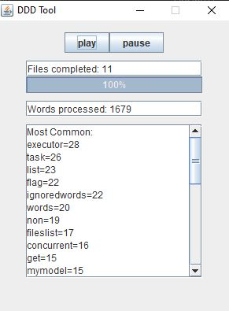

# Concurrent-DDD-Ubiquitous-Language-Verifier
Multithreaded program for Domain-Driven-Design. Counts the most common words in your code, to verify the correspondence between vocabulary used in the sw development and domain-model. (Linguistic Consistency) Built during Concurrent and Distributed Programming Course.

## Idea
A good software is designed based on the requirements of the customer, these requirements have a special vocabulary based on the field in which the sw is used. 
Moreover, the code model has to mirror the domain and it's responsibility of the programmers to understand the language of the customer and build an "Ubiquitous Language".
 
This tool can help to find the most common words used in the code, to check if variables and concepts in the code are present in the model. 
Sometimes new concepts and vocabulary can rise from the codebase and highlight a lacking design or the necessity of additions.

Viceversa, it can also used i.e. in the user stories of the customer, to understand the most common concepts and check if they are modelled. 

It is customizable:
- You can specify the directory to analyze. (by default "src")
- You can customize the words to ignore. (by default it ignores keywords of most common languages)

## Run 
``` bash
./gradlew run
```

or [download the jar here](https://github.com/igor-lirussi/Concurrent-DDD-Ubiquitous-Language-Verifier/releases/latest/download/Concurrent-DDD-Ubiquitous-Language-Verifier.jar) and

```
java -jar Concurrent-DDD-Ubiquitous-Language-Verifier.jar files_directory number_top_words file_words_to_ignore
```

## Result


## Built With

*   Java

## Authors

*   **Igor Lirussi** @ University of Bologna

## License

This project is under a License - see the [LICENSE](LICENSE) file for details
